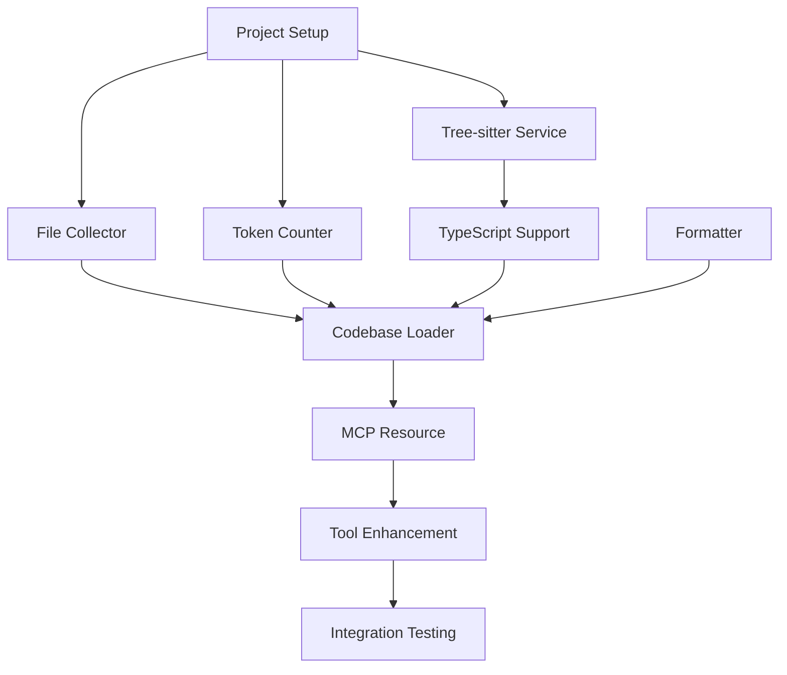

# Codebase Loading Feature - Work Tracking

This document tracks the detailed implementation tasks for the codebase loading feature. Each task is broken down into atomic, testable units with clear acceptance criteria.

## Task Organization

- **Status**: 🔴 Not Started | 🟡 In Progress | 🟢 Complete | 🔵 Blocked
- **Effort**: S (1-2 hours) | M (3-5 hours) | L (6-8 hours) | XL (>8 hours)
- **Priority**: P0 (Critical) | P1 (High) | P2 (Medium) | P3 (Low)

## MVP (Milestone 1) - Basic Codebase Loading

Reference: [CODEBASE_LOADING_PLAN.md#MVP](./CODEBASE_LOADING_PLAN.md#mvp-milestone-1---basic-codebase-loading)

### 1.1 Project Setup & Dependencies
**Status**: 🔴 | **Effort**: S | **Priority**: P0

**Tasks**:
- [ ] Install tree-sitter dependencies
  ```bash
  npm install web-tree-sitter@^0.24.7
  npm install --save-dev @types/web-tree-sitter
  ```
- [ ] Create directory structure
  ```
  src/services/codebase/
  src/services/treeSitter/
  src/resources/
  ```
- [ ] Update TypeScript config for new modules
- [ ] Add tree-sitter to CLAUDE.md development commands

**Acceptance Criteria**:
- Dependencies installed without conflicts
- TypeScript recognizes tree-sitter types
- Directory structure matches architecture plan

### 1.2 Tree-sitter Service Foundation
**Status**: 🔴 | **Effort**: M | **Priority**: P0

**File**: `src/services/treeSitter/treeSitterService.ts`

**Tasks**:
- [ ] Create TreeSitterService class with singleton pattern
- [ ] Implement parser initialization
- [ ] Add error handling for WASM loading
- [ ] Create unit tests for initialization

**Code Structure**:
```typescript
export class TreeSitterService {
  private static instance: TreeSitterService;
  private parser: Parser | null = null;
  private initialized = false;
  
  static getInstance(): TreeSitterService
  async initialize(): Promise<void>
  async parseFile(content: string, language: string): Promise<Parser.Tree>
  dispose(): void
}
```

**Acceptance Criteria**:
- Service initializes without errors
- Can parse a simple TypeScript file
- Proper cleanup on disposal
- 100% test coverage

### 1.3 TypeScript Language Support
**Status**: 🔴 | **Effort**: M | **Priority**: P0

**File**: `src/services/treeSitter/languages/typescript.ts`

**Tasks**:
- [ ] Install TypeScript WASM grammar
  ```bash
  npm install tree-sitter-typescript
  ```
- [ ] Create TypeScript language loader
- [ ] Implement basic tree-sitter query for TypeScript
- [ ] Add language detection for .ts/.tsx files

**Code Structure**:
```typescript
export class TypeScriptLanguage {
  static readonly FILE_EXTENSIONS = ['.ts', '.tsx', '.mts', '.cts'];
  
  async loadGrammar(): Promise<Parser.Language>
  getBasicQuery(): string
  detectLanguage(filePath: string): boolean
}
```

**Acceptance Criteria**:
- Successfully loads TypeScript grammar
- Can parse TypeScript files into AST
- Correctly identifies TypeScript files by extension

### 1.4 File Collection Service
**Status**: 🔴 | **Effort**: L | **Priority**: P0

**File**: `src/services/codebase/fileCollector.ts`

**Tasks**:
- [ ] Implement recursive directory scanning
- [ ] Add .gitignore pattern matching
- [ ] Create file filtering logic
- [ ] Add security checks (no .env, keys, etc.)
- [ ] Implement file prioritization
- [ ] Add progress callback support

**Code Structure**:
```typescript
export interface FileInfo {
  path: string;
  relativePath: string;
  size: number;
  extension: string;
  content?: string;
}

export class FileCollector {
  constructor(private options: FileCollectorOptions)
  
  async collectFiles(rootPath: string): Promise<FileInfo[]>
  private shouldIncludeFile(filePath: string): boolean
  private loadGitignorePatterns(rootPath: string): string[]
}
```

**Acceptance Criteria**:
- Respects .gitignore patterns
- Excludes sensitive files by default
- Handles symbolic links safely
- Provides accurate file counts
- Performance: <1s for 1000 files

### 1.5 Token Counter Implementation
**Status**: 🔴 | **Effort**: M | **Priority**: P0

**File**: `src/services/codebase/tokenCounter.ts`

**Tasks**:
- [ ] Research accurate token counting for Gemini
- [ ] Implement character-to-token estimation
- [ ] Add file-type specific counting rules
- [ ] Create token budget tracker
- [ ] Add unit tests with known examples

**Code Structure**:
```typescript
export class TokenCounter {
  private static readonly CHARS_PER_TOKEN = 4; // Approximate
  
  estimateTokens(content: string): number
  estimateFileTokens(fileInfo: FileInfo): number
  calculateBudget(files: FileInfo[], maxTokens: number): FileInfo[]
}
```

**Acceptance Criteria**:
- Token estimates within 10% of actual
- Handles different file types appropriately
- Efficient calculation for large files

### 1.6 Codebase Formatter
**Status**: 🔴 | **Effort**: M | **Priority**: P0

**File**: `src/services/codebase/codebaseFormatter.ts`

**Tasks**:
- [ ] Implement XML formatting structure
- [ ] Add metadata generation
- [ ] Create file content wrapping with CDATA
- [ ] Add tree structure visualization
- [ ] Implement format validation

**Code Structure**:
```typescript
export class CodebaseFormatter {
  formatAsXML(files: FileInfo[], metadata: CodebaseMetadata): string
  private generateMetadata(files: FileInfo[]): string
  private formatFile(file: FileInfo): string
  private generateTreeView(files: FileInfo[]): string
}
```

**Reference**: [Codebase Format Example](./CODEBASE_LOADING_PLAN.md#codebase-format-example)

**Acceptance Criteria**:
- Valid XML output
- Preserves code formatting
- Includes all metadata fields
- LLM-friendly structure

### 1.7 Basic Codebase Loader
**Status**: 🔴 | **Effort**: L | **Priority**: P0

**File**: `src/services/codebase/codebaseLoader.ts`

**Tasks**:
- [ ] Integrate FileCollector, TokenCounter, and Formatter
- [ ] Implement loading pipeline
- [ ] Add error handling and logging
- [ ] Create progress reporting
- [ ] Add configuration options

**Code Structure**:
```typescript
export interface CodebaseLoaderOptions {
  maxTokens?: number;
  includePatterns?: string[];
  excludePatterns?: string[];
  fileExtensions?: string[];
}

export class CodebaseLoader {
  constructor(private options: CodebaseLoaderOptions)
  
  async load(rootPath: string): Promise<string>
  async loadWithProgress(
    rootPath: string, 
    onProgress: (progress: LoadProgress) => void
  ): Promise<string>
}
```

**Acceptance Criteria**:
- Loads complete codebase within token limit
- Handles errors gracefully
- Provides accurate progress updates
- Configurable via options

### 1.8 MCP Resource Implementation
**Status**: 🔴 | **Effort**: M | **Priority**: P0

**File**: `src/resources/codebaseResource.ts`

**Tasks**:
- [ ] Create CodebaseResource class
- [ ] Implement MCP resource interface
- [ ] Add resource registration logic
- [ ] Handle resource permissions
- [ ] Add caching for resource reads

**Code Structure**:
```typescript
export class CodebaseResource {
  static readonly URI = 'codebase://current';
  
  async read(): Promise<string>
  getMetadata(): ResourceMetadata
  private getCachedCodebase(): string | null
  private invalidateCache(): void
}
```

**Reference**: [MCP Resource Registration](./CODEBASE_LOADING_PLAN.md#mcp-resource-registration)

**Acceptance Criteria**:
- Resource accessible via MCP protocol
- Proper MIME type and metadata
- Efficient caching mechanism
- Thread-safe operations

### 1.9 Gemini Tool Enhancement
**Status**: 🔴 | **Effort**: M | **Priority**: P0

**File**: `src/tools/geminiTool.ts` (modification)

**Tasks**:
- [ ] Add includeCodebase parameter to schema
- [ ] Add codebasePath parameter
- [ ] Implement codebase loading logic
- [ ] Update tool documentation
- [ ] Add parameter validation

**Schema Updates**:
```typescript
includeCodebase: z.boolean()
  .describe("Include the current codebase in the context")
  .optional()
  .default(false),

codebasePath: z.string()
  .describe("Path to the codebase root directory")
  .optional(),
```

**Acceptance Criteria**:
- Backward compatible changes
- Clear parameter documentation
- Validates codebase path exists
- Integrates smoothly with existing tool

### 1.10 Integration & Testing
**Status**: 🔴 | **Effort**: L | **Priority**: P0

**Tasks**:
- [ ] Create integration tests for full pipeline
- [ ] Test with sample TypeScript project
- [ ] Verify token counting accuracy
- [ ] Test error scenarios
- [ ] Performance benchmarking
- [ ] Update README with new feature

**Test Scenarios**:
```typescript
describe('Codebase Loading Integration', () => {
  test('loads small TypeScript project');
  test('respects gitignore patterns');
  test('stays within token limit');
  test('handles missing directories');
  test('formats valid XML output');
});
```

**Acceptance Criteria**:
- All tests passing
- <5s load time for 100 files
- Accurate token counts
- No memory leaks
- Documentation updated

## Milestone 2 - Tree-sitter Compression

Reference: [CODEBASE_LOADING_PLAN.md#milestone-2](./CODEBASE_LOADING_PLAN.md#milestone-2---tree-sitter-compression)

### 2.1 Compression Strategy Interface
**Status**: 🔴 | **Effort**: S | **Priority**: P1

**File**: `src/services/treeSitter/compressionStrategy.ts`

**Tasks**:
- [ ] Define CompressionStrategy interface
- [ ] Create compression level enum
- [ ] Add token estimation methods
- [ ] Define AST node filtering criteria

### 2.2 TypeScript Compression Implementation
**Status**: 🔴 | **Effort**: L | **Priority**: P1

**File**: `src/services/treeSitter/strategies/typescriptCompression.ts`

**Tasks**:
- [ ] Implement signature extraction query
- [ ] Add node filtering logic
- [ ] Create output formatting
- [ ] Handle edge cases (anonymous functions, etc.)
- [ ] Optimize performance

### 2.3 Query Builder System
**Status**: 🔴 | **Effort**: M | **Priority**: P1

**File**: `src/services/treeSitter/queryBuilder.ts`

**Tasks**:
- [ ] Create dynamic query construction
- [ ] Add query caching mechanism
- [ ] Implement query validation
- [ ] Support different compression levels

## Quality Assurance Tasks

### QA.1 Code Quality Standards
**Status**: 🔴 | **Effort**: M | **Priority**: P0

**Tasks**:
- [ ] Add ESLint rules for new code patterns
- [ ] Create code review checklist
- [ ] Set up pre-commit hooks
- [ ] Add JSDoc comments to all public APIs
- [ ] Create architectural decision records (ADRs)

### QA.2 Performance Monitoring
**Status**: 🔴 | **Effort**: M | **Priority**: P1

**Tasks**:
- [ ] Add performance metrics collection
- [ ] Create benchmarking suite
- [ ] Set up memory profiling
- [ ] Add performance regression tests

### QA.3 Security Review
**Status**: 🔴 | **Effort**: M | **Priority**: P0

**Tasks**:
- [ ] Security audit for file access
- [ ] Path traversal prevention
- [ ] Sensitive data detection
- [ ] Resource limit enforcement

## Documentation Tasks

### DOC.1 API Documentation
**Status**: 🔴 | **Effort**: M | **Priority**: P1

**Tasks**:
- [ ] Document all public APIs
- [ ] Create usage examples
- [ ] Add troubleshooting guide
- [ ] Generate API reference

### DOC.2 Architecture Documentation
**Status**: 🔴 | **Effort**: S | **Priority**: P1

**Tasks**:
- [ ] Update architecture diagrams
- [ ] Document design decisions
- [ ] Create sequence diagrams
- [ ] Add component interaction docs

## Progress Summary

### MVP Tasks
- Total Tasks: 10 main tasks + subtasks
- Completed: 0
- In Progress: 0
- Blocked: 0

### Estimated Timeline
- MVP: 2-3 weeks (1 developer)
- Milestone 2: Additional 1-2 weeks
- Full Feature Set: 6-8 weeks total

## Risk Register

| Risk | Impact | Probability | Mitigation |
|------|--------|-------------|------------|
| Tree-sitter WASM loading issues | High | Medium | Test early, have fallback |
| Token counting inaccuracy | Medium | High | Research Gemini tokenizer |
| Performance with large codebases | High | Medium | Implement streaming early |
| Memory usage spikes | High | Low | Add resource limits |

## Dependencies Between Tasks



## Next Steps

1. Review and approve task breakdown
2. Set up development environment
3. Begin with Task 1.1 (Project Setup)
4. Daily progress updates in this document
5. Weekly architecture review meetings

---

*Last Updated: [Date]*
*Next Review: [Date]*